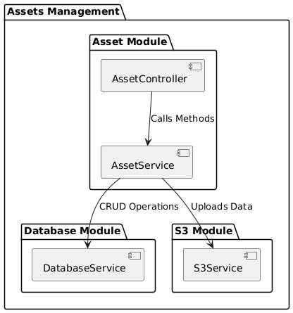

# Asset Management Service

This is a Node.js service built with [NestJS](https://nestjs.com/) for managing asset data using CRUD operations. The service uses a cloud-based database to store asset information and integrates with AWS S3 for storing retrieved entries in JSON format.

## Features

- **CRUD Operations**: Create, retrieve, update, and delete assets.
- **Filtering**: Retrieve assets based on `id` or `last updated time`.
- **AWS S3 Integration**: All retrieved entries are stored in an S3 bucket.
- **Cloud Database**: Uses an RDS cloud-based database for scalable and efficient data management.

## Tech Stack

- **Node.js** (v16+)
- **NestJS** - Backend framework
- **AWS S3** - For storing asset data files
- **Cloud Database** (AWS RDS MySQL)

## Architecture

The architecture is modular and consists of three primary modules:

- **Assets Module**: Handles all CRUD operations and integrates with the Database and S3 modules.
- **Database Module**: Manages interactions with the cloud-based database.
- **S3 Module**: Uploads and manages asset data files in the S3 bucket.

